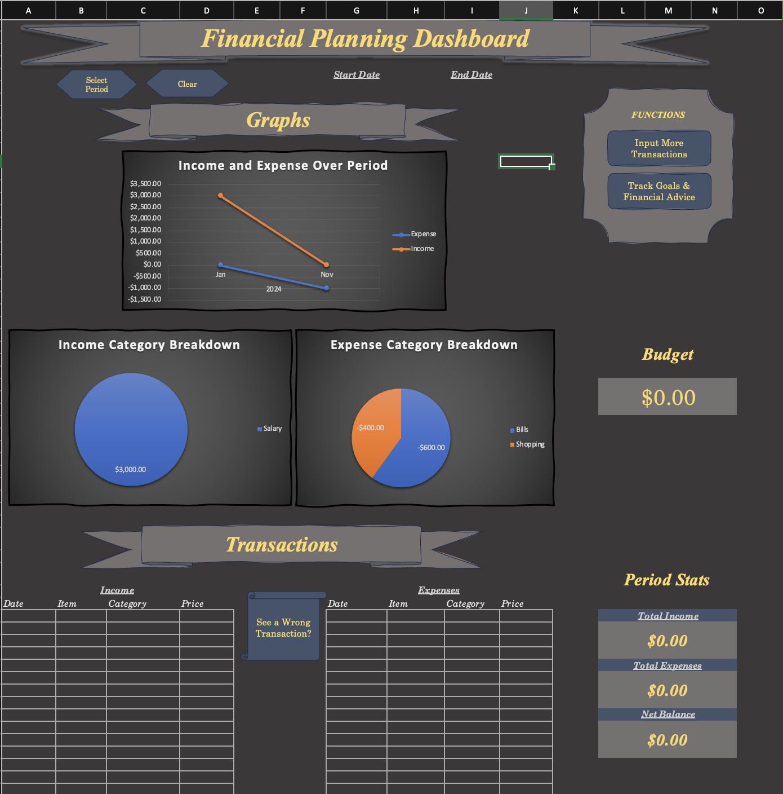
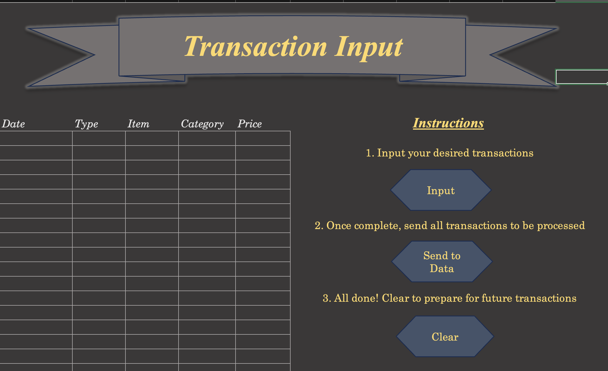
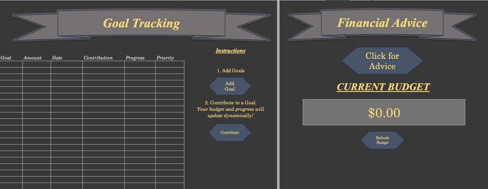

# Personal Financial Planner 💰📊

A robust Excel-based financial planner designed to help users manage their finances effectively. Built using VBA, this tool allows seamless tracking of **expenses**, **income**, and **savings**, providing users with clear and actionable insights into their financial health.

## Features ✨
- **Expense and Income Tracking:** Easily input and track daily expenses and income to manage your budget. 💵
- **Savings Goals:** Set and monitor progress toward your savings goals with dynamic progress indicators. 🏦
- **User-Friendly Interface:** Includes 6 custom forms for an intuitive experience. 🖥️
- **Efficient Calculation System:** Over 30 macros streamline backend calculations, reducing manual work. ⚙️

## Technology Used 🔧
- **Excel VBA**: Core language used to automate calculations and build user interfaces. 🖱️
- **UserForms**: Designed for easy interaction and data input. 📝

## Getting Started 🚀

### Prerequisites 📋
- Microsoft Excel (2010 or later)
- Macros enabled for full functionality

### Installation 💾
1. Clone or download this repository.
2. Open `FinancialPlanner.xlsm` in Excel.
3. Enable macros when prompted to allow full functionality of the financial tool.

### Usage 🛠️
- **Dashboard** Output transactions from any period. See stats like budget, total income, total expenses, etc.
- **Transaction Input** Record and categorize transactions that the tool can analyze
- **Goal Monitoring** Goals with priorities can be added and contributed to, dynamically adjusting budget
- **Financial Advice** Receive financial advice to achieve specific goals or for overall health

## Screenshots 📸

